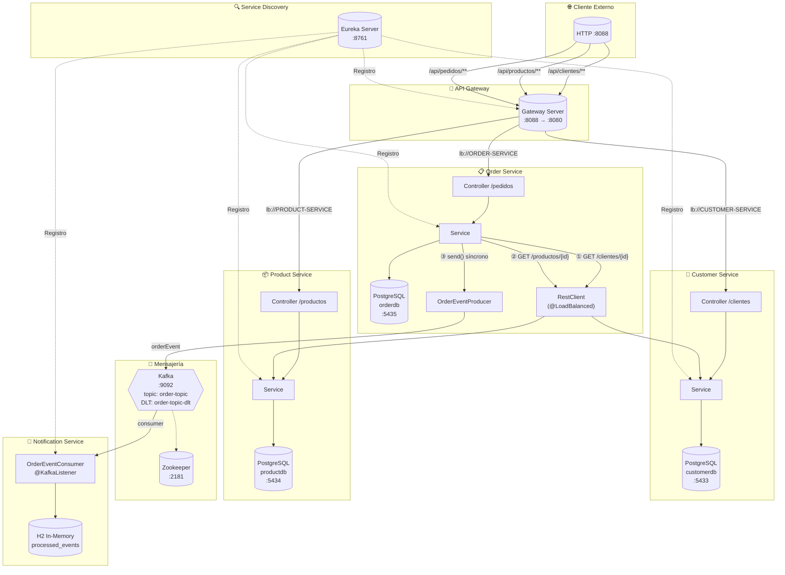
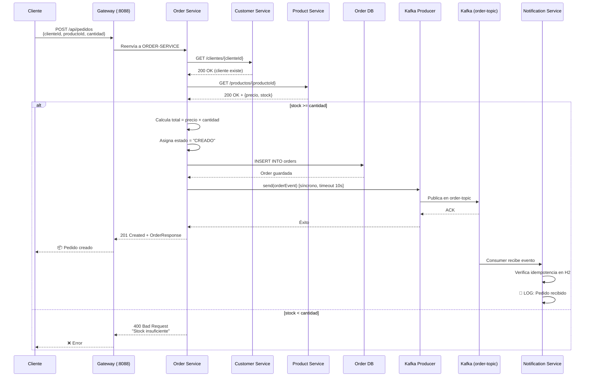
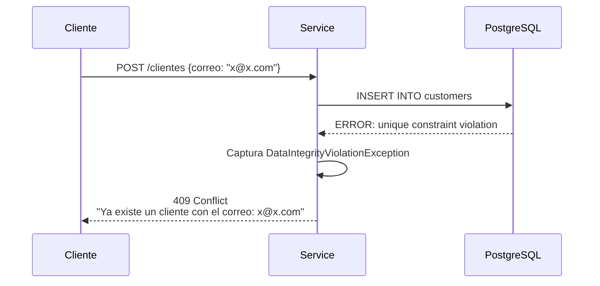
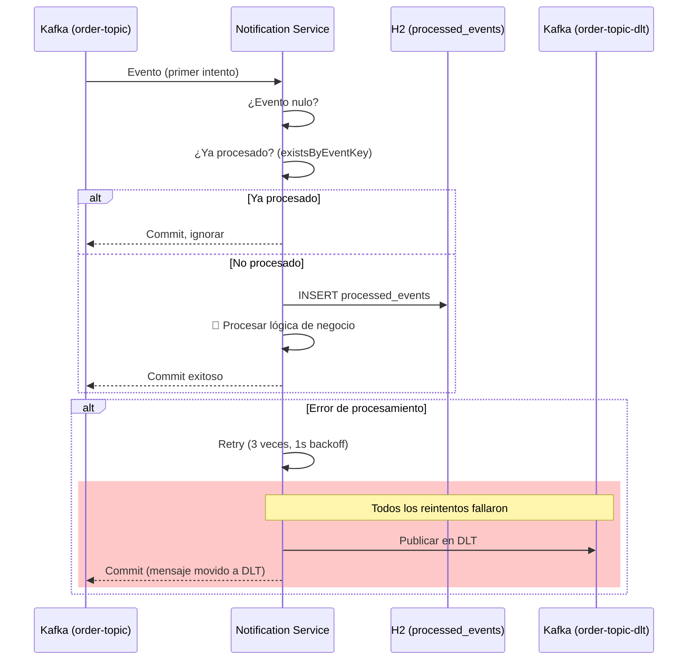
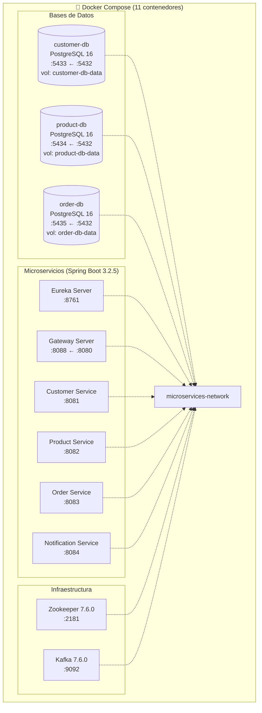

# Diagrama de Arquitectura

## Flujo de comunicación entre servicios



## Flujo de creación de un pedido (paso a paso)



## Flujo de validación de datos duplicados



## Consumo resiliente de Kafka (dead-letter + idempotencia)



## Topología de Docker



## Endpoints disponibles

| Método | Ruta | Descripción | Servicio |
|--------|------|-------------|----------|
| POST | `/api/clientes` | Crear cliente | Customer |
| GET | `/api/clientes` | Listar clientes (paginado) | Customer |
| GET | `/api/clientes/{id}` | Obtener cliente por ID | Customer |
| PUT | `/api/clientes/{id}` | Actualizar cliente | Customer |
| DELETE | `/api/clientes/{id}` | Eliminar cliente | Customer |
| POST | `/api/productos` | Crear producto | Product |
| GET | `/api/productos` | Listar productos (paginado) | Product |
| GET | `/api/productos/{id}` | Obtener producto por ID | Product |
| PUT | `/api/productos/{id}` | Actualizar producto | Product |
| DELETE | `/api/productos/{id}` | Eliminar producto | Product |
| POST | `/api/pedidos` | Crear pedido (valida cliente, producto y stock) | Order |
| GET | `/api/pedidos` | Listar pedidos (paginado) | Order |
| GET | `/api/pedidos/{id}` | Obtener pedido por ID | Order |
| DELETE | `/api/pedidos/{id}` | Eliminar pedido | Order |

## Patrones implementados

| Patrón | Implementación |
|--------|----------------|
| **API Gateway** | Spring Cloud Gateway con Eureka discovery (`lb://`) |
| **Service Discovery** | Netflix Eureka (todos los servicios se registran) |
| **Database per Service** | Cada microservicio tiene su propia BD PostgreSQL |
| **Event-Driven Async** | Kafka producer en order-service, consumer en notification-service |
| **Dead Letter Topic** | `order-topic-dlt` para mensajes fallidos después de 3 reintentos |
| **Idempotent Consumer** | Tabla `processed_events` (H2) para filtrar duplicados |
| **Transactional Outbox (simplificado)** | Kafka send síncrono dentro de `@Transactional` de JPA |
| **Saga Coreografía** | order-service orquesta validación vía RestClient a customer/product |
| **Pagination** | Spring Data `Pageable` en todos los endpoints `findAll` |
| **Global Exception Handler** | `@RestControllerAdvice` compartido vía common-lib |
| **CORS** | Gateway con `CorsWebFilter` permitiendo todos los orígenes |

## Cómo probar el flujo completo

```bash
# 1. Asegurar que los JARs están compilados
mvn clean package -DskipTests

# 2. Levantar toda la infraestructura
docker compose up --build -d

# 3. Verificar que todos los contenedores están healthy
docker compose ps

# 4. Importar postman_collection.json en Postman
# 5. Ejecutar en orden:
#    - Crear cliente → Crear producto → Crear pedido
# 6. Verificar logs del notification-service:
docker compose logs notification-service

# 7. Para ver el evento publicado en Kafka (opcional):
docker compose exec kafka kafka-console-consumer \
  --bootstrap-server localhost:9092 \
  --topic order-topic \
  --from-beginning

# 8. Para ver mensajes fallidos en el DLT:
docker compose exec kafka kafka-console-consumer \
  --bootstrap-server localhost:9092 \
  --topic order-topic-dlt \
  --from-beginning
```
